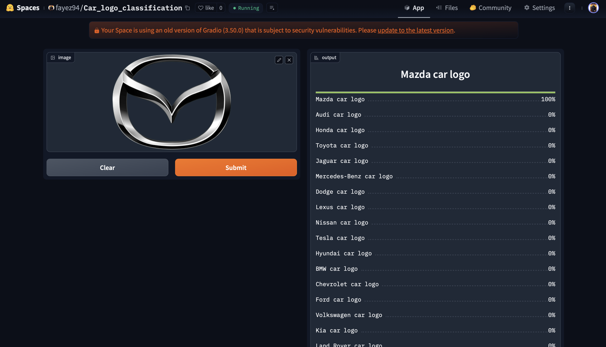

# Car-logo-classification
An image classification model from data collection, cleaning, model training, deployment and API integration.  
The model can classify 20 different types of logos of cars  
The types are following:  

* Audi car logo
* BMW car logo
* Chevrolet car logo
* Dodge car logo
* Ford car logo
* Honda car logo
* Hyundai car logo
* Jaguar car logo
* Jeep car logo
* Kia car logo
* Land Rover car logo
* Lexus car logo
* Mazda car logo
* Mercedes-Benz car logo
* Nissan car logo
* Porsche car logo
* Subaru car logo
* Tesla car logo
* Toyota car logo
* Volkswagen car logo

# Dataset Preparation
**Data Collection:** Downloaded from DuckDuckGo using term name  
**DataLoader:** Used fastai DataBlock API to set up the DataLoader.  
**Data Augmentation:** fastai provides default data augmentation which operates in GPU.  
Details can be found in `notebooks/training.ipynb`

# Training and Data Cleaning
**Training:** Fine-tuned a resnet101 model for 15 epochs (3 times) and got upto ~94% accuracy.  
**Data Cleaning:** This part took the most time. Since I collected data from the browser, there was a lot of noise, including irrelevant images. I cleaned and updated the dataset using FastAI's ImageClassifierCleaner, performing data cleaning after each training or fine-tuning iteration—except for the final iteration, which served as the model's last version.  

# Model Deployment
I deployed to model to HuggingFace Spaces Gradio App. The implementation can be found in `deployment` folder or [here](https://huggingface.co/spaces/fayez94/Car_logo_classification).  

# API integration with GitHub Pages
The deployed model API is integrated [here](https://fayez94.github.io/Car-logo-classification/logo_classification.html) in GitHub Pages Website. Implementation and other details can be found in `docs` folder.

