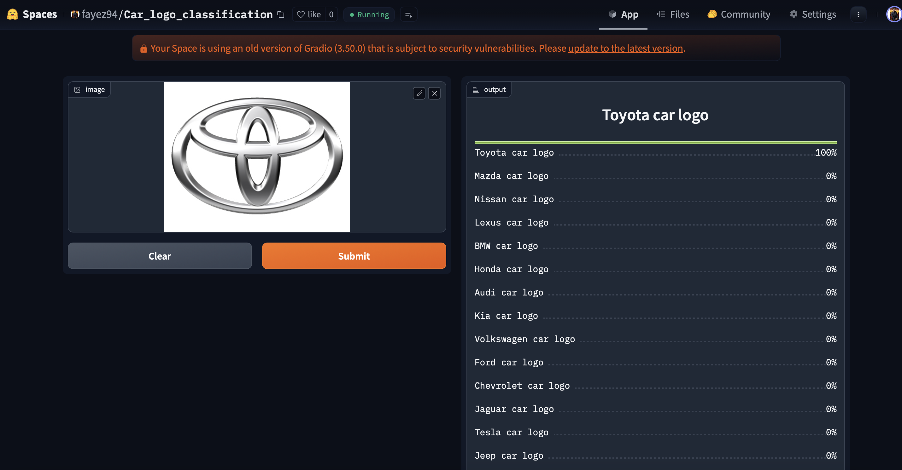

# Car-logo-classification
An image classification model from data collection, cleaning, model training, deployment and API integration. <br/>
The model can classify 20 different types of logos of cars <br/>
The types are following: <br/>

* Audi car logo
* BMW car logo
* Chevrolet car logo
* Dodge car logo
* Ford car logo
* Honda car logo
* Hyundai car logo
* Jaguar car logo
* Jeep car logo
* Kia car logo
* Land Rover car logo
* Lexus car logo
* Mazda car logo
* Mercedes-Benz car logo
* Nissan car logo
* Porsche car logo
* Subaru car logo
* Tesla car logo
* Toyota car logo
* Volkswagen car logo

## 📌 Project Workflow

### 1️⃣ Problem Statement
Develop an AI-powered model to classify various car logos from images.

### 2️⃣ Data Collection
- Used **DuckDuckGo** image search to collect images of **20 car logo categories**.
- Automated image downloading with **FastAI’s `search_images_ddg` function**.
- Maintained a balanced dataset across all categories.

### 3️⃣ Data Preprocessing
- Removed duplicate and irrelevant images.
- Standardized image size to **224x224 pixels**.
- Applied **data augmentation** (rotation, flipping, zoom, lighting adjustments) for robustness.

### 4️⃣ Model Training
- Used **ResNet34** with **transfer learning**.
- Implemented **FastAI’s `cnn_learner`** for efficient training.
- Employed **cross-entropy loss** and **Adam optimizer**.
- Split dataset into **training and validation sets**.

### 5️⃣ Model Evaluation
- Achieved **93% accuracy** on the validation set.
- Analyzed misclassifications with a **confusion matrix**.
- Identified areas for improvement.

### 6️⃣ Model Deployment
- Exported model using `learner.export()`.
- Built an interactive **Gradio-based web interface**.
- Deployed the model on **Hugging Face Spaces**.

### 7️⃣ Future Improvements
- Expand dataset for better generalization.
- Experiment with **ResNet50 or EfficientNet** for higher accuracy.
- Implement **active learning** for dataset refinement.

## Data Collection and Preparation

### Data Collection
The dataset was collected from DuckDuckGo using car brand names as search terms, ensuring diverse images for training.

### DataLoader
The **fastai DataBlock API** was used to set up the `DataLoader`, organizing the data into training and validation sets.

### Data Augmentation
**fastai** provides default GPU-accelerated data augmentations, improving the model's generalization.

For more details, check the [Data_prep_logo_classi.ipynb](notebooks/Data_prep_logo_classi.ipynb) notebook.

## Training, Data Cleaning, and Inference

### **Training**
The model was fine-tuned using **ResNet101** for 15 epochs, repeated 3 times, achieving an accuracy of approximately **94%**.
Details can be found in [training.ipynb](notebooks/training.ipynb)

### **Data Cleaning**
Data cleaning was the most time-consuming part of the process. Since the data was collected from a browser, there was a significant amount of noise, and some images contained irrelevant content. To clean and update the dataset, I used the **fastai ImageClassifierCleaner**.
Data cleaning was performed after each training or fine-tuning session, except for the final iteration, which represented the final model.
Details can be found in [data_cleaning.ipynb](notebooks/data_cleaning.ipynb)

### **Inference**
For inference, the trained model is used to classify new car logo images. The **fastai Learner** was utilized to load the fine-tuned model and make predictions. This allows the model to classify unseen car logos accurately, based on the learned patterns during training.
Details can be found in [inference.ipynb](notebooks/inference.ipynb)


## Model Deployment
I deployed to model to HuggingFace Spaces Gradio App. The implementation can be found in `deployment` folder or [here](https://huggingface.co/spaces/fayez94/Car_logo_classification). <br/>


## API integration with GitHub Pages
The deployed model API is integrated [here](https://fayez94.github.io/Car-logo-classification/logo_classification.html) in GitHub Pages Website. Implementation and other details can be found in `docs` folder.

## 🚀 Project Usage Guide

Follow these steps to set up and run the project on your local machine.

### 1️⃣ Clone the Repository
```bash
git clone https://github.com/fayez94/Car-logo-classification.git
cd Car_Logo_Classification
```

### 2️⃣ Create and Activate a Virtual Environment

#### 🔹 For Windows:
```bash
python -m venv myvenv
myvenv\Scripts\activate
```

#### 🔹 For macOS/Linux:
```bash
python3 -m venv myvenv
source myvenv/bin/activate
```

### 3️⃣ Install Required Dependencies
```bash
pip install -r requirements.txt
```

### 4️⃣ Run the app file

```bash
python app.py
```

### 5️⃣ Deactivating the Virtual Environment
```bash
deactivate
```

## Contributions

Contributions are always welcome! If you'd like to contribute to the Car Logo Classifier project, here’s how you can help:

### How to Contribute:
1. Fork the repository
2. Create a new branch (`git checkout -b feature-name`)
3. Make your changes
4. Commit your changes (`git commit -m 'Add new feature'`)
5. Push to the branch (`git push origin feature-name`)
6. Open a Pull Request

### Ways You Can Contribute:
- Add support for new car logo categories or labels
- Improve the accuracy of the model by fine-tuning or experimenting with new architectures
- Enhance data collection or augmentation techniques
- Update documentation or add more examples
- Report bugs or suggest new features

Thank you for considering contributing! 🙏

## 📬 Contact
For any questions or suggestions, feel free to reach out!

📧 Email: mdfayezullah2624@gmail.com  
🐙 GitHub: [fayez94](https://github.com/fayez94)


